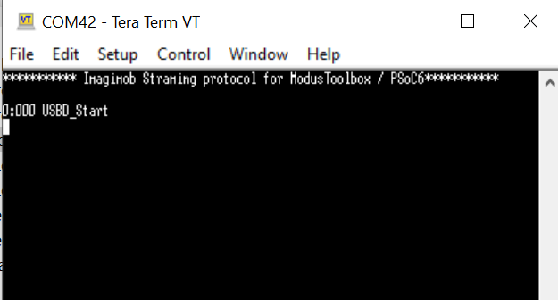
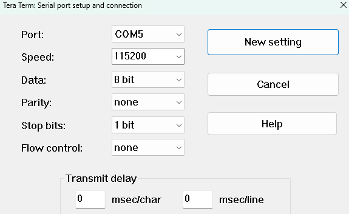
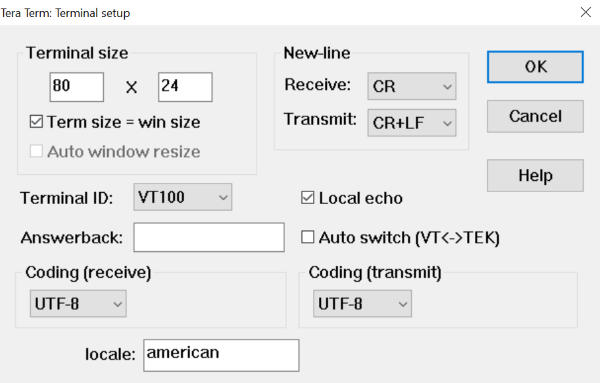
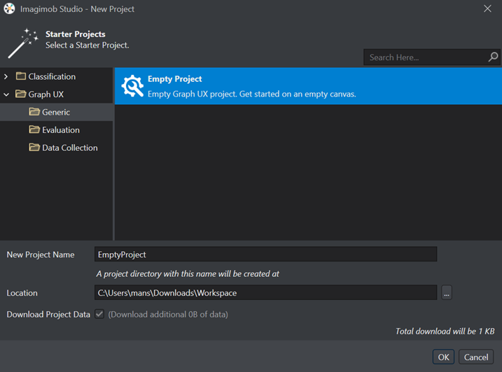
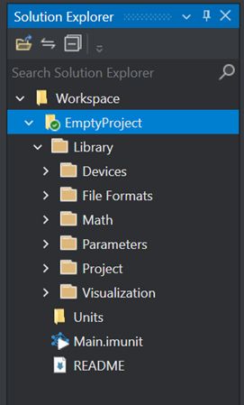
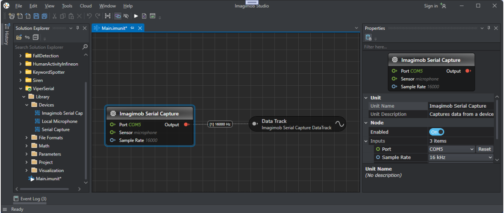
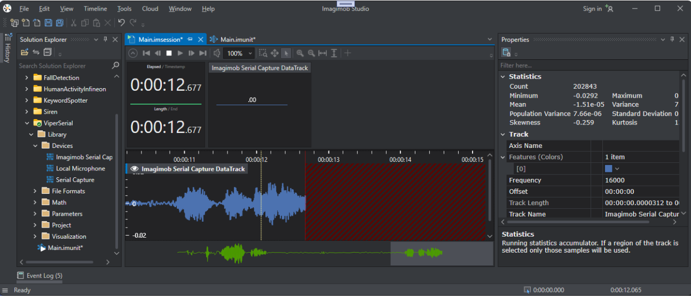

# Imagimob streaming protocol for PSoC&trade; 6

This ModusToolbox&trade; firmware project implements the [Imagimob streaming protocol](PROTOCOL.md) for PSoC&trade; 6. This firmware supports collecting data from one of this sensors - motion, magnetometer, pressure, radar sensors, and PDM/PCM microphone by setting SHIELD_DATA_COLLECTION to the right shield board in the Makefile.


[View this README on GitHub.](https://github.com/Infineon/mtb-example-imagimob-streaming-protocol)

[Provide feedback on this code example.](https://cypress.co1.qualtrics.com/jfe/form/SV_1NTns53sK2yiljn?Q_EED=eyJVbmlxdWUgRG9jIElkIjoiQ0UyMzk2OTEiLCJTcGVjIE51bWJlciI6IjAwMi0zOTY5MSIsIkRvYyBUaXRsZSI6IkltYWdpbW9iIHN0cmVhbWluZyBwcm90b2NvbCBmb3IgUFNvQyZ0cmFkZTsgNiIsInJpZCI6InNoYWhoZXRhbWl0ayIsIkRvYyB2ZXJzaW9uIjoiMS4yLjAiLCJEb2MgTGFuZ3VhZ2UiOiJFbmdsaXNoIiwiRG9jIERpdmlzaW9uIjoiTUNEIiwiRG9jIEJVIjoiSUNXIiwiRG9jIEZhbWlseSI6IlBTT0MifQ==)


## Requirements

- [ModusToolbox&trade;](https://www.infineon.com/modustoolbox) v3.1 or later (tested with v3.1)
- Programming language: C
- Associated parts: All [PSoC&trade; 6 MCU](https://www.infineon.com/PSoC6) parts
- PSoC&trade; 6 board support package (BSP) minimum required version: 4.0.0


## Supported toolchains (make variable 'TOOLCHAIN')

- GNU Arm&reg; Embedded Compiler v10.3.1 (`GCC_ARM`) – Default value of `TOOLCHAIN`
- Arm&reg; Compiler v6.22 (`ARM`)
- IAR C/C++ Compiler v9.50.2 (`IAR`)


## Supported kits (make variable 'TARGET')

- [PSoC&trade; 6 AI Evaluation Kit](https://www.infineon.com/CY8CKIT-062S2-AI) (`CY8CKIT-062S2-AI`) – Default value of `TARGET`
- [PSoC&trade; 62S2 Wi-Fi Bluetooth&reg; Pioneer Kit](https://www.infineon.com/CY8CKIT-062S2-43012) (`CY8CKIT-062S2-43012`)

## Hardware setup

Connect an Arduino shield ([CY8CKIT-028-EPD](https://www.infineon.com/CY8CKIT-028-EPD), [CY8CKIT-028-SENSE](https://www.infineon.com/CY8CKIT-028-SENSE), [CY8CKIT-028-TFT](https://www.infineon.com/CY8CKIT-028-TFT), or [SHIELD_XENSIV_A](https://www.infineon.com/SHIELD_XENSIV_A)) to the baseboard's Arduino header.

> **Note:** For the CY8CKIT-062S2-AI, shield is not needed.

This example uses the board's default configuration. See the kit user guide to ensure that the board is configured correctly.

Connect the USB Type-C cable to the SHIELD_XENSIV_A USB connector (J11) when the CY8CKIT-062S2-43012 is powered only with the MCU USB (J7). This will enable the power supply for the magnetometer sensor.


## Software setup

See the [ModusToolbox&trade; tools package installation guide](https://www.infineon.com/ModusToolboxInstallguide) for information about installing and configuring the tools package.

Install [Imagimob Studio](https://developer.imagimob.com/) if not already installed.

Install a terminal emulator if you don't have one. Instructions in this document use [Tera Term](https://teratermproject.github.io/index-en.html).


## Using the code example

### Create the project

The ModusToolbox&trade; tools package provides the Project Creator as both a GUI tool and a command line tool.

<details><summary><b>Use Project Creator GUI</b></summary>

1. Open the Project Creator GUI tool.

   There are several ways to do this, including launching it from the dashboard or from inside the Eclipse IDE. For more details, see the [Project Creator user guide](https://www.infineon.com/ModusToolboxProjectCreator) (locally available at *{ModusToolbox&trade; install directory}/tools_{version}/project-creator/docs/project-creator.pdf*).

2. On the **Choose Board Support Package (BSP)** page, select a kit supported by this code example. See [Supported kits](#supported-kits-make-variable-target).

   > **Note:** To use this code example for a kit not listed here, you may need to update the source files. If the kit does not have the required resources, the application may not work.

3. On the **Select Application** page:

   a. Select the **Applications(s) Root Path** and the **Target IDE**.

   > **Note:** Depending on how you open the Project Creator tool, these fields may be pre-selected for you.

   b.	Select this code example from the list by enabling its check box.

   > **Note:** You can narrow the list of displayed examples by typing in the filter box.

   c. (Optional) Change the suggested **New Application Name** and **New BSP Name**.

   d. Click **Create** to complete the application creation process.

</details>

<details><summary><b>Use Project Creator CLI</b></summary>

The 'project-creator-cli' tool can be used to create applications from a CLI terminal or from within batch files or shell scripts. This tool is available in the *{ModusToolbox&trade; install directory}/tools_{version}/project-creator/* directory.

Use a CLI terminal to invoke the 'project-creator-cli' tool. On Windows, use the command-line 'modus-shell' program provided in the ModusToolbox&trade; installation instead of a standard Windows command-line application. This shell provides access to all ModusToolbox&trade; tools. You can access it by typing "modus-shell" in the search box in the Windows menu. In Linux and macOS, you can use any terminal application.

The following example clones the "[mtb-example-imagimob-streaming-protocol](https://github.com/Infineon/
mtb-example-imagimob-streaming-protocol)" application with the desired name "ImagimobStreamingProtocol" configured for the *CY8CKIT-062S2-AI* BSP into the specified working directory, *C:/mtb_projects*:

   ```
   project-creator-cli --board-id CY8CKIT-062S2-AI --app-id mtb-example-ml-imagimob--streaming-protocol --user-app-name ImagimobStreamingProtocol --target-dir "C:/mtb_projects"
   ```


The 'project-creator-cli' tool has the following arguments:

Argument | Description | Required/optional
---------|-------------|-----------
`--board-id` | Defined in the <id> field of the [BSP](https://github.com/Infineon?q=bsp-manifest&type=&language=&sort=) manifest | Required
`--app-id`   | Defined in the <id> field of the [CE](https://github.com/Infineon?q=ce-manifest&type=&language=&sort=) manifest | Required
`--target-dir`| Specify the directory in which the application is to be created if you prefer not to use the default current working directory | Optional
`--user-app-name`| Specify the name of the application if you prefer to have a name other than the example's default name | Optional

<br>

> **Note:** The project-creator-cli tool uses the `git clone` and `make getlibs` commands to fetch the repository and import the required libraries. For details, see the "Project creator tools" section of the [ModusToolbox&trade; tools package user guide](https://www.infineon.com/ModusToolboxUserGuide) (locally available at {ModusToolbox&trade; install directory}/docs_{version}/mtb_user_guide.pdf).

</details>


### Open the project

After the project has been created, you can open it in your preferred development environment.


<details><summary><b>Eclipse IDE</b></summary>

If you opened the Project Creator tool from the included Eclipse IDE, the project will open in Eclipse automatically.

For more details, see the [Eclipse IDE for ModusToolbox&trade; user guide](https://www.infineon.com/MTBEclipseIDEUserGuide) (locally available at *{ModusToolbox&trade; install directory}/docs_{version}/mt_ide_user_guide.pdf*).

</details>


<details><summary><b>Visual Studio (VS) Code</b></summary>

Launch VS Code manually, and then open the generated *{project-name}.code-workspace* file located in the project directory.

For more details, see the [Visual Studio Code for ModusToolbox&trade; user guide](https://www.infineon.com/MTBVSCodeUserGuide) (locally available at *{ModusToolbox&trade; install directory}/docs_{version}/mt_vscode_user_guide.pdf*).

</details>


<details><summary><b>Keil µVision</b></summary>

Double-click the generated *{project-name}.cprj* file to launch the Keil µVision IDE.

For more details, see the [Keil µVision for ModusToolbox&trade; user guide](https://www.infineon.com/MTBuVisionUserGuide) (locally available at *{ModusToolbox&trade; install directory}/docs_{version}/mt_uvision_user_guide.pdf*).

</details>


<details><summary><b>IAR Embedded Workbench</b></summary>

Open IAR Embedded Workbench manually, and create a new project. Then select the generated *{project-name}.ipcf* file located in the project directory.

For more details, see the [IAR Embedded Workbench for ModusToolbox&trade; user guide](https://www.infineon.com/MTBIARUserGuide) (locally available at *{ModusToolbox&trade; install directory}/docs_{version}/mt_iar_user_guide.pdf*).

</details>


<details><summary><b>Command line</b></summary>

If you prefer to use the CLI, open the appropriate terminal, and navigate to the project directory. On Windows, use the command-line 'modus-shell' program; on Linux and macOS, you can use any terminal application. From there, you can run various `make` commands.

For more details, see the [ModusToolbox&trade; tools package user guide](https://www.infineon.com/ModusToolboxUserGuide) (locally available at *{ModusToolbox&trade; install directory}/docs_{version}/mtb_user_guide.pdf*).

</details>


## Operation

### Testing with the terminal

The protocol runs with text commands in a simple Run-Eval-Print loop (REPL), which makes it possible to interact with it using a serial terminal.

1. Connect the board to your PC using the provided USB cable through the KitProg3 USB connector. The example is set up to use the CY8CKIT-062S2-AI.

   If you are using the CY8CKIT-062S2-43012, update the `SHIELD_DATA_COLLECTION` variable corresponding to `APP_CY8CKIT-062S2-43012` in the *Makefile*.

   - if using the SHIELD_XENSIV_A shield, change to `SHIELD_DATA_COLLECTION=XENSIV_SHIELD` in the Makefile.
   - if using the CY8CKIT-028-TFT shield, change to `SHIELD_DATA_COLLECTION=TFT_SHIELD` in the Makefile.
   - if using the CY8CKIT-028-EPD shield, change to `SHIELD_DATA_COLLECTION=EPD_SHIELD` in the Makefile.
   - if using the CY8CKIT-028-SENSE shield, selection depends on kit version:

   To check the version of CY8CKIT-028-SENSE, locate the sticker on the bottom of the shield's box which indicates the revision.

   - If the shield is Rev "**" or "*A", use `SHIELD_DATA_COLLECTION=SENSE_SHIELD`.
   - If the shield is Rev "*B" or later, use `SHIELD_DATA_COLLECTION=SENSE_SHIELD_v2`.
   >**NOTE:** While switching between different shield for data collection, do clean the application (`make clean`) before building it again.
2. Open a terminal program and select the KitProg3 COM port. Set the serial port parameters to 8N1 and 115200 baud.

3. Program the board using one of the following:

   <details><summary><b>Using Eclipse IDE</b></summary>

      1. Select the application project in the Project Explorer.

      2. In the **Quick Panel**, scroll down, and click **\<Application Name> Program (KitProg3_MiniProg4)**.
   </details>


   <details><summary><b>In other IDEs</b></summary>

   Follow the instructions in your preferred IDE.
   </details>


   <details><summary><b>Using CLI</b></summary>

     From the terminal, execute the `make program` command to build and program the application using the default toolchain to the default target. The default toolchain is specified in the application's Makefile but you can override this value manually:
      ```
      make program TOOLCHAIN=<toolchain>
      ```

      Example:
      ```
      make program TOOLCHAIN=GCC_ARM
      ```
   </details>

4. After programming, the application starts automatically.
   Confirm that "Imagimob streaming protocol for ModusToolbox / PSoC6" is displayed on the UART terminal.

   **Figure 1. Terminal output on program startup**

   


5. Connect the board to the PC through PSoC&trade; 6 USB connector using the USB cable. This enables a serial port for sensor data collection.

6. Ensure that the power LED (D1) turns ON, indicating the board is powered.

7. In the terminal application, open the serial connection to the device. It should present itself as USB serial device. Connect to this port with the following settings:

     Baud rate: 115200 bps; Data: 8 bits; Parity: None; stop: 1 bit; Flow control: None

     **Figure 2. Serial port settings**

     


8. Set the terminal settings as follows:
    - Newlines should be transmitted as CR+LF.
    - Enable local echo.

   **Figure 3. Terminal settings**

   


9. Enter `config?`, press enter (to send CR+LF), and verify that the device responds with a JSON structure describing the configuration.

   **Figure 4. Terminal test**

   

10. Enter `subscribe,1,16000` and verify that the device streams audio data.

    Notice that it is set to stop after 5 seconds unless it receives heartbeat commands.The garbled text on the terminal is the audio data.

11. Type `subscribe,2,50` and verify that the device streams motion sensor data.

    Notice that sample collection stops after 5 seconds. The garbled text on the terminal is the motion data.

12. Type `subscribe,3,50` and verify that the device streams magnetometer sensor data.

    Notice that sample collection stops after 5 seconds. The garbled text on the terminal is the magnetometer data.

13. Type `subscribe,4,16` and verify that the device streams radar sensor data.    

    Notice that sample collection stops after 5 seconds. The garbled text on the terminal is the radar data. 

13. Type `subscribe,5,50` and verify that the device streams pressure sensor data.    

    Notice that sample collection stops after 5 seconds. The garbled text on the terminal is the pressure and temperature data. 
    
14. Type `subscribe,6,50` and verify that the device streams gyroscope data.    

    Notice that sample collection stops after 5 seconds. The garbled text on the terminal is the gyroscope data.


> **Note:** Currently backspace is not supported in terminal commands. If you encounter issues such as being unable to see commands on the terminal or receiving unknown command errors, follow the step below:
>- Reset the terminal and clear the buffer.
>- Reset board to ensure a fresh execution.

### Test with Imagimob Studio

#### Create project in Imagimob Studio

1. Open Imagimob Studio and select **File** > **New Project**. The New Project window appears.

    **Figure 5. Studio new project**

    

2. Under **Graph UX** > **Generic**, select **EmptyProject**.

3. In **New Project Name**, enter the name of the project.

4. In **Location**, specify the location to create the workspace and the project directory.

5. Click **OK** to create the project. The project directory is downloaded to the workspace in Imagimob Studio.

    **Figure 6. Solution Explorer**

    

#### Connect and set up Serial Capture to collect data

1. Connect the board to the laptop or PC through PSoC&trade; 6 USB connector using the USB cable.

2. Expand the EmptyProject directory and double-click **Main.imunit** to open the canvas.

3. Expand **Library** > **Devices** and drag and drop the **Serial Capture** unit onto the canvas.

4. Expand **Visualization** and drag and drop the **Data Track** unit onto the canvas.

5. Click on the red icon in the **Serial Capture** node and drag over to the gray icon in the **Data Track** node.

    This creates a connection between the two nodes.

     **Figure 7. Studio graph**

     


> **Note:** To check the COM port at which the board is connected, open **Device Manager** > **Ports** and look for USB Serial Device.

> **Note:** The microphone collects data at a sampling rate of 16000 and an accelerometer collects data at a sampling rate of 50.

6. Click the **Start** toolbar. (white triangle) to start a session.

7. In the session tab, click **Record** (white circle) and verify that audio data is being streamed to the session.

    **Figure 8. Studio timeline**

    

8. To stop recording, click **Stop Recording** (white square).


## Debugging


You can debug the example to step through the code.


<details><summary><b>In Eclipse IDE</b></summary>

Use the **\<Application Name> Debug (KitProg3_MiniProg4)** configuration in the **Quick Panel**. For details, see the "Program and debug" section in the [Eclipse IDE for ModusToolbox&trade; user guide](https://www.infineon.com/MTBEclipseIDEUserGuide).


> **Note:** **(Only while debugging)** On the CM4 CPU, some code in `main()` may execute before the debugger halts at the beginning of `main()`. This means that some code executes twice – once before the debugger stops execution, and again after the debugger resets the program counter to the beginning of `main()`. See [KBA231071](https://community.infineon.com/docs/DOC-21143) to learn about this and for the workaround.

</details>


<details><summary><b>In other IDEs</b></summary>

Follow the instructions in your preferred IDE.

</details>


## Design and implementation

This code example allows collecting data from one of this sensors - motion, magnetometer, pressure, radar sensors and PDM/PCM microphone using the [Imagimob Studio](https://developer.imagimob.com/).

### motion capture
The code example is designed to collect data from a motion sensor (BMX160 or BMI160 or BMI270). The data consists of the 3-axis accelerometer data obtained from the motion sensor. A timer is configured to interrupt at 50 Hz to sample the motion sensor. The interrupt handler reads all data from the sensor via I2C or SPI and the data is then transmitted over USB and stored using [Imagimob Studio](https://developer.imagimob.com/).

### PDM/PCM capture
The code example can be configured to collect pulse density modulation (PDM) to pulse code modulation(PCM) audio data. The PDM/PCM is sampled at 16 kHz and an interrupt is generated after 1024 samples are collected. After collecting 1024 samples, the data is transmitted over USB.

### MAGNETOMETER capture
The code example can be configured to collect data from magnetometer sensor (BMM350). The data consists of the 3-axis magnetometer data obtained from the magnetometer (BMM350) sensor. A timer is configured to interrupt at 50 Hz to sample the magnetometer (BMM350) sensor. The interrupt handler reads all data from the sensor via I2C, the data is then transmitted over USB.

### PRESSURE capture
The code example can be configured to collect data from Pressure sensor (DPS368). A timer is configured to interrupt at 50 Hz to sample the Pressure sensor. The interrupt handler reads all data from the sensor via I2C, the data is then transmitted over USB.

### RADAR capture
The code example can be configured to collect data from Radar sensor (BGT60TR13C). A timer is configured to interrupt at 100000 Hz to sample the Radar sensor. The interrupt handler reads all data from the sensor via SPI, the data is then transmitted over USB.

### Configuration

This code example is designed to work with one of the Arduino Shields produced by Infineon that includes a motion sensor. To select the shield that is currently being used, modify the *Makefile* to change the define that is being specified. By default, the example uses the CY8CKIT-028-SENSE shield v1 for CY8CKIT-062S2-43012. The valid options are as follows:
   - **EPD_SHIELD**: For the CY8CKIT-028-EPD with the BMI160 sensor and microphones
   - **SENSE_SHIELDv1**: For the CY8CKIT-028-SENSE with the BMX160 sensor and microphones
   - **SENSE_SHIELDv2**: For the CY8CKIT-028-SENSE with the BMI160 sensor and microphones
   - **TFT_SHIELD**: For the CY8CKIT-028-TFT with the BMI160 sensor and microphones
   - **AI_KIT**: For CY8CKIT-062S2-AI with BGT60TR13C, BMI270, BMM350, DPS368 sensors and microphones
   - **XENSIV_SHIELD**: For the SHIELD_XENSIV_A with the BMI270, BMM350, DPS368 sensors and microphones

### Resources and settings

**Table 1. Application resources**

 Resource  |  Alias/object     |    Purpose
 :-------- | :-------------    | :------------
 GPIO (HAL)    | CYBSP_USER_LED     | User LED
 UART (HAL)|cy_retarget_io_uart_obj| UART HAL object used by Retarget-IO for the Debug UART port
 Timer (HAL) | imu_read_timer  | Timer HAL object used to periodically read from the IMU
 I2C (HAL) | i2c_obj           | I2C HAL object used to communicate with the motion sensor (used for the [CY8CKIT-028-EPD](https://www.infineon.com/CY8CKIT-028-EPD), [CY8CKIT-028-TFT](https://www.infineon.com/CY8CKIT-028-TFT), or [SHIELD_XENSIV_A](https://www.infineon.com/SHIELD_XENSIV_A) shields or [CY8CKIT-062S2-AI](https://www.infineon.com/CY8CKIT-062S2-AI))
 SPI (HAL) | spi_obj           | SPI HAL object used to communicate with the motion sensor (used for the [CY8CKIT-028-SENSE](https://www.infineon.com/CY8CKIT-028-SENSE) shield)

<br>

## Files and folders

```
|-- deps                  # Project dependency references. These are managed with the Library Manager.
|-- images                # Images used for this README.md.
|-- source                # Contains the code source files for this example.
   |- audio.c/h           # Implements audio capture from the PDM microphone.
   |- clock.c/h           # Implements a simple millisecond clock used by the protocol implementation.
   |- config.h            # Sample application configuration.
   |- imu.c/h             # Implements motion data capture from an IMU (typically on a shield board). These files are not used in the default configuration.
   |- main.c              # Main function that initializes drivers and runs the main loop.
   |- protocol.c.h        # Implements the Imagimob streaming protocol.
   |- streaming.c/h       # Implements data streaming over USB or debug UART used by the protocol implementation.
|-- Makefile              # Build makefile. You may need to edit this to specify a shield board, change the serial interface from USB to debug UART (see below) and other build customization.
|--PROTOCOL.md            # Complete protocol specification.
|--README.md              # This file.


```

## Related resources


Resources  | Links
-----------|----------------------------------
Application notes  | [AN228571](https://www.infineon.com/AN228571) – Getting started with PSoC&trade; 6 MCU on ModusToolbox&trade; <br>  [AN215656](https://www.infineon.com/AN215656) – PSoC&trade; 6 MCU: Dual-CPU system design
Code examples  | [Using ModusToolbox&trade;](https://github.com/Infineon/Code-Examples-for-ModusToolbox-Software) on GitHub
Device documentation | [PSoC&trade; 6 MCU datasheets](https://documentation.infineon.com/html/psoc6/bnm1651211483724.html) <br> [PSoC&trade; 6 technical reference manuals](https://documentation.infineon.com/html/psoc6/zrs1651212645947.html)
Development kits | Select your kits from the [Evaluation board finder](https://www.infineon.com/cms/en/design-support/finder-selection-tools/product-finder/evaluation-board).
Libraries on GitHub  | [mtb-pdl-cat1](https://github.com/Infineon/mtb-pdl-cat1) – PSoC&trade; 6 Peripheral Driver Library (PDL)  <br> [mtb-hal-cat1](https://github.com/Infineon/mtb-hal-cat1) – Hardware Abstraction Layer (HAL) library <br> [retarget-io](https://github.com/Infineon/retarget-io) – Utility library to retarget STDIO messages to a UART port
Middleware on GitHub  | [psoc6-middleware](https://github.com/Infineon/modustoolbox-software#psoc-6-middleware-libraries) – Links to all PSoC&trade; 6 MCU middleware
Tools  | [ModusToolbox&trade;](https://www.infineon.com/modustoolbox) – ModusToolbox&trade; software is a collection of easy-to-use libraries and tools enabling rapid development with Infineon MCUs for applications ranging from wireless and cloud-connected systems, edge AI/ML, embedded sense and control, to wired USB connectivity using PSoC&trade; Industrial/IoT MCUs, AIROC&trade; Wi-Fi and Bluetooth&reg; connectivity devices, XMC&trade; Industrial MCUs, and EZ-USB&trade;/EZ-PD&trade; wired connectivity controllers. ModusToolbox&trade; incorporates a comprehensive set of BSPs, HAL, libraries, configuration tools, and provides support for industry-standard IDEs to fast-track your embedded application development.

<br>

## Other resources


Infineon provides a wealth of data at [www.infineon.com](https://www.infineon.com) to help you select the right device, and quickly and effectively integrate it into your design.


## Document history


Document title: *CE239691* - *Imagimob streaming protocol for PSoC&trade; 6*

 Version | Description of change
 ------- | ---------------------
 1.0.0   | New code example
 1.1.0   | Added support for data collection using magnetometer, pressure, and radar sensors <br> Added support for SHIELD_XENSIV_A
 1.2.0   | Added support for data collection for gyroscope
<br>


All referenced product or service names and trademarks are the property of their respective owners.

The Bluetooth&reg; word mark and logos are registered trademarks owned by Bluetooth SIG, Inc., and any use of such marks by Infineon is under license.


---------------------------------------------------------

© Cypress Semiconductor Corporation, 2024. This document is the property of Cypress Semiconductor Corporation, an Infineon Technologies company, and its affiliates ("Cypress").  This document, including any software or firmware included or referenced in this document ("Software"), is owned by Cypress under the intellectual property laws and treaties of the United States and other countries worldwide.  Cypress reserves all rights under such laws and treaties and does not, except as specifically stated in this paragraph, grant any license under its patents, copyrights, trademarks, or other intellectual property rights.  If the Software is not accompanied by a license agreement and you do not otherwise have a written agreement with Cypress governing the use of the Software, then Cypress hereby grants you a personal, non-exclusive, nontransferable license (without the right to sublicense) (1) under its copyright rights in the Software (a) for Software provided in source code form, to modify and reproduce the Software solely for use with Cypress hardware products, only internally within your organization, and (b) to distribute the Software in binary code form externally to end users (either directly or indirectly through resellers and distributors), solely for use on Cypress hardware product units, and (2) under those claims of Cypress's patents that are infringed by the Software (as provided by Cypress, unmodified) to make, use, distribute, and import the Software solely for use with Cypress hardware products.  Any other use, reproduction, modification, translation, or compilation of the Software is prohibited.
<br>
TO THE EXTENT PERMITTED BY APPLICABLE LAW, CYPRESS MAKES NO WARRANTY OF ANY KIND, EXPRESS OR IMPLIED, WITH REGARD TO THIS DOCUMENT OR ANY SOFTWARE OR ACCOMPANYING HARDWARE, INCLUDING, BUT NOT LIMITED TO, THE IMPLIED WARRANTIES OF MERCHANTABILITY AND FITNESS FOR A PARTICULAR PURPOSE.  No computing device can be absolutely secure.  Therefore, despite security measures implemented in Cypress hardware or software products, Cypress shall have no liability arising out of any security breach, such as unauthorized access to or use of a Cypress product. CYPRESS DOES NOT REPRESENT, WARRANT, OR GUARANTEE THAT CYPRESS PRODUCTS, OR SYSTEMS CREATED USING CYPRESS PRODUCTS, WILL BE FREE FROM CORRUPTION, ATTACK, VIRUSES, INTERFERENCE, HACKING, DATA LOSS OR THEFT, OR OTHER SECURITY INTRUSION (collectively, "Security Breach").  Cypress disclaims any liability relating to any Security Breach, and you shall and hereby do release Cypress from any claim, damage, or other liability arising from any Security Breach.  In addition, the products described in these materials may contain design defects or errors known as errata which may cause the product to deviate from published specifications. To the extent permitted by applicable law, Cypress reserves the right to make changes to this document without further notice. Cypress does not assume any liability arising out of the application or use of any product or circuit described in this document. Any information provided in this document, including any sample design information or programming code, is provided only for reference purposes.  It is the responsibility of the user of this document to properly design, program, and test the functionality and safety of any application made of this information and any resulting product.  "High-Risk Device" means any device or system whose failure could cause personal injury, death, or property damage.  Examples of High-Risk Devices are weapons, nuclear installations, surgical implants, and other medical devices.  "Critical Component" means any component of a High-Risk Device whose failure to perform can be reasonably expected to cause, directly or indirectly, the failure of the High-Risk Device, or to affect its safety or effectiveness.  Cypress is not liable, in whole or in part, and you shall and hereby do release Cypress from any claim, damage, or other liability arising from any use of a Cypress product as a Critical Component in a High-Risk Device. You shall indemnify and hold Cypress, including its affiliates, and its directors, officers, employees, agents, distributors, and assigns harmless from and against all claims, costs, damages, and expenses, arising out of any claim, including claims for product liability, personal injury or death, or property damage arising from any use of a Cypress product as a Critical Component in a High-Risk Device. Cypress products are not intended or authorized for use as a Critical Component in any High-Risk Device except to the limited extent that (i) Cypress's published data sheet for the product explicitly states Cypress has qualified the product for use in a specific High-Risk Device, or (ii) Cypress has given you advance written authorization to use the product as a Critical Component in the specific High-Risk Device and you have signed a separate indemnification agreement.
<br>
Cypress, the Cypress logo, and combinations thereof, ModusToolbox, PSoC, CAPSENSE, EZ-USB, F-RAM, and TRAVEO are trademarks or registered trademarks of Cypress or a subsidiary of Cypress in the United States or in other countries. For a more complete list of Cypress trademarks, visit www.infineon.com. Other names and brands may be claimed as property of their respective owners.
